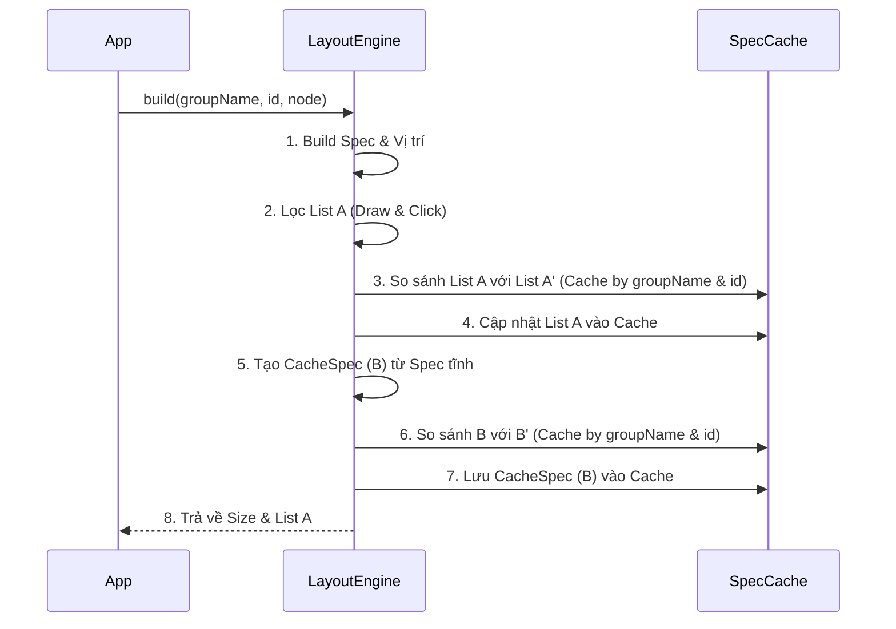

# Tài liệu Cấu trúc Node Engine (TProject)
Project được thiết kế để chuyển toàn bộ luồng tính toán và thiết kế ui vào background thread, luồng ui thread thì chỉ còn vẽ lên thôi.

---

## 1. Thành phần Hệ thống

### 🌳 Node (Cấu trúc Cây)
Lớp chứa thông tin định nghĩa UI và logic xây dựng.
- **Vai trò**: Chứa thông tin thuộc tính (Properties) và logic khởi tạo Spec (Build Spec).
- **Phân loại**:
    - `ViewNode`: Node cơ bản cho các thành phần UI.
    - `TextNode`: Chứa text, font, màu sắc.
    - `ImageNode`: Chứa nguồn ảnh, scale type.
    - ... (và các loại node khác).

### 🎨 Spec (Lệnh vẽ & Trạng thái)
Thực hiện việc vẽ thực tế dựa trên thông tin được cung cấp từ Node.
- **Đặc điểm**:
    - **So sánh (Diffing)**: Lưu thông tin node để so sánh xem nội dung có thay đổi hay không.
    - **Cờ trạng thái (Flags)**:
        - `isDrawable`: Xác định Spec có khả năng vẽ hay không.
        - `isStatic`: Xác định Spec tĩnh để gộp vào CacheSpec.
- **Các phương thức chính**:
    - `draw(canvas)`: Thực hiện vẽ lên màn hình.
    - `onAttachedToWindow()` / `onDetachedFromWindow()`: Quản lý vòng đời khi gắn vào/tách khỏi View.
    - `onRelease()`: Giải phóng tài nguyên (Bitmap, bộ nhớ) khi không còn sử dụng.

### 🏷️ Các loại DrawSpec
- `TextSpec`: Vẽ văn bản.
- `ImageSpec`: Vẽ hình ảnh.
- `BackgroundSpec`: Vẽ nền, bo góc.
- `GroupSpec`: Nhóm các Spec lại với nhau.
- **`CacheSpec`**: Gộp các Spec tĩnh (`isStatic`) lại với nhau thành một đơn vị duy nhất để tối ưu hiệu năng vẽ.

---

## 2. Quy trình xử lý của LayoutEngine

`LayoutEngine` điều phối việc chuyển đổi từ Node sang Spec thông qua 2 hàm chính:

### Hàm 1: Build & Compute Layout
Thực hiện xây dựng Spec và tính toán vị trí trong View dựa trên `groupName` và `id: String`. Quy trình gồm 8 bước:
0.  **Chỉ cho phép hoạt động ở background thread
0.1 ** lấy ra danh sách cache theo groupdname và id
1.  **Build Spec**: Xây dựng danh sách Spec và xác định vị trí của chúng trong View (truyền cache nào, nếu cái nào được tái xử dụng thì xóa khỏi danh sách cache)
3.  **Đưa danh sách còn lại trong cache vào mảng hàng đợi để giải phóng
2.  **Filter**: Lọc ra danh sách các Spec thực sự thực hiện vẽ và các Spec có xử lý sự kiện click (**List A**).
4.  **Save Cache A**: Lưu danh sách Spec mới (**List A**) vào bộ nhớ đệm theo `groupName` và `id`.
5.  **Static Grouping**: Gom các Spec tĩnh trong List A để tạo thành một **`CacheSpec` (B)**.
6.  **Cache Diffing (CacheSpec)**: Lấy `CacheSpec` cũ từ bộ nhớ đệm (**B'**) dựa trên `groupName` và `id` để so sánh với **B**:
    - Tận dụng lại nếu không đổi, ngược lại giải phóng Spec cũ (gọi onRelase + xóa khỏi cache)
7.  **Save Cache B**: Lưu **CacheSpec (B)** mới vào cache theo bộ đôi `groupName` và `id`.
8.  **Output**: Trả về thông tin kích thước View và danh sách Spec A để hiển thị.

### Hàm 2: Release
- Giải phóng toàn bộ các Spec liên quan dựa vào `groupName`. (gọi onRelase + xóa khỏi cache)
- Thường được gọi khi màn hình hoặc Component không còn tồn tại để tối ưu bộ nhớ.

---

## 3. Sơ đồ Luồng (Sequence Diagram)

